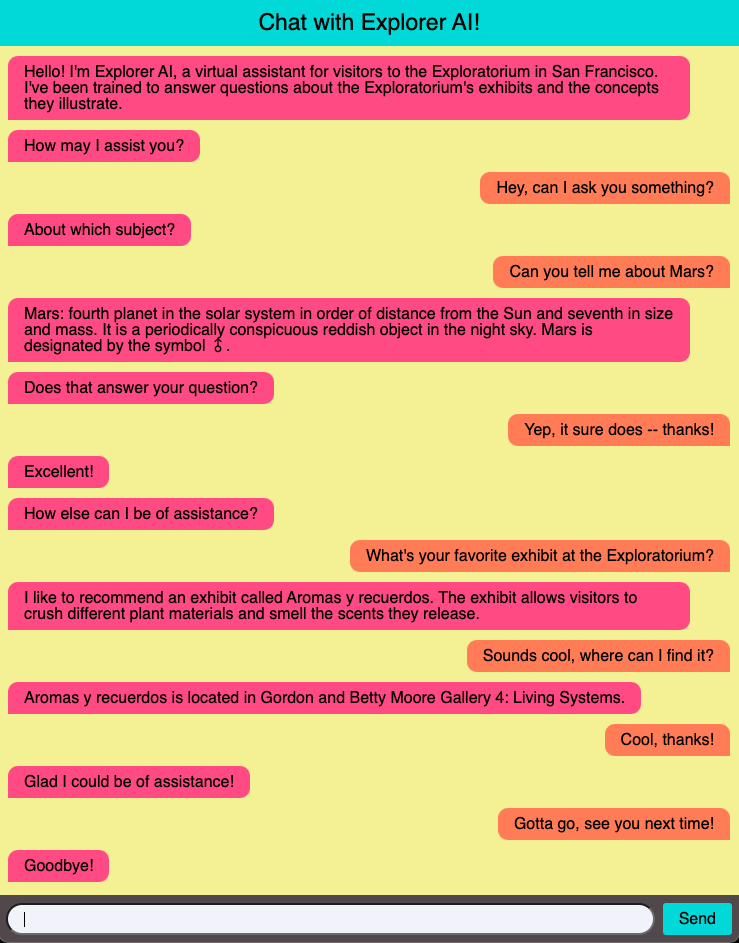

# Explorer AI

🤖 A conversational chatbot designed to assist and educate visitors to 
[The Exploratorium](https://www.exploratorium.edu/about-us), "a public learning laboratory exploring the world through 
science, art, and human perception."

---

### Introduction

Explorer AI is trained to function as a virtual docent for the Exploratorium in San Francisco. The idea that it would 
be able to answer basic questions that 
[a human docent at the Exploratorium](https://www.exploratorium.edu/exhibits/human-phenomena-explainer-station) might 
be asked by a patron. In particular, Explorer AI is trained to respond to the following categories of user intents:
  - Get an explanation for a concept or phenomena which is illustrated by some exhibit at the Exporatorium
  - Get information about a specific exhibit at the Exploratorium, identified by (common) name
    - Brief description
    - Current location (e.g. gallery)
    - Names of creator(s)
    - Year of creation
  - Get exhibit recommendations

---

### Modeling

Explorer AI is built on [Rasa](https://rasa.com/docs/rasa/), an open-source framework for conversation-driven 
development. Its model uses Rasa's 
[DIET classifier](https://rasa.com/blog/introducing-dual-intent-and-entity-transformer-diet-state-of-the-art-performance-on-a-lightweight-architecture/) 
to label the user's intent and extract any important information from their message. And for dialog management (deciding 
when to listen, and when/how to respond), the model relies on a collection of "policies", which include strategies 
ranging from straightforward if-then rules to the implementation of transformers (e.g. the 
[TED policy](https://rasa.com/docs/rasa/policies/#ted-policy)).
The configuration of [the model's 
training pipeline](https://rasa.com/docs/rasa/tuning-your-model/) is located in `modeling/rasa/config.yml`. 
The conversational training data used by the [NLU side of the model](https://rasa.com/docs/rasa/nlu-training-data/) 
can be found in `chatbot/rasa/data/nlu`, and the collection of rules learned by the bot are located in 
`chatbot/rasa/data/rules`. Finally, Explorer AI's "domain" (a checklist of everything it needs to know) is located in 
the file `chatbot/rasa/domain.yml`. 

### Data

Explorer AI's knowledgebase (which it draws upon when constructing many responses) consists of 
both institutional data (facts about and summaries of each of the museum's exhibits and galleries), as well as 
subject-matter data (general information about the concepts and phenomena illustrated by the exhibits).
The institutional data, which is located in `data/data/institutional`, was build through a process which began with 
using [Scrapy](https://scrapy.org) to web-scrape the pages at
[exploratorium.edu](https://www.exploratorium.edu) related to exhibits and galleries, and culminated with requests to 
the [completion endpoint](https://platform.openai.com/docs/api-reference/completions) of Open AI's GPT-3, which 
provided very nice summaries, etc., for each of the exhibits and galleries. Code related to the construction of the 
institutional data is located in `data/web_scraping` and `data/processing`.
The subject-matter data, found at `data/data/subject_matter/advanced_data.json`, is built from articles published by
the Encyclopedia Britannica, and obtained through [their API](https://encyclopaediaapi.com/). The articles chosen for 
the dataset were those having titles which matched (using a combination of 
[fuzzy matching](https://pypi.org/project/fuzzywuzzy/) and 
[GloVe pre-trained word embeddings](https://nlp.stanford.edu/projects/glove/)) at least
one of the exhibit's keywords. Code related to the construction of the subject-matter data is located in 
`data/get_articles`.

### Deployment

Explorer AI was deployed as a simple web-app running in a network of Docker 
containers hosted on a Google Cloud E2 (Ubuntu 18.04) instance.
(Note that Explorer AI was recently taken offline due to the unsustainable cost of cloud computing.)
The application network consists of four processes: 

- The backend server (referred to often as `rasa_server` in the code and configurations), which performs language 
understanding and prediction tasks. The related code is found at `app/backend`.
- The action server, which defines and performs all custom actions Explorer AI must perform during the conversation. 
The related code, as well as a copy of the chatbot's knowledgebase, is located at `app/actions`.
- The [Nginx](https://docs.nginx.com/nginx/admin-guide/web-server/web-server/) web server, which is configured to serve 
static content from `app/web/html/index.html` as well as proxy all communication between the client and backend service 
via a [socket.io](https://socket.io/docs/v4/) channel. Along with this proxy gateway, the server's security is backed
by full TLS support. SSL certificates were obtained through [Let's Encrypt](https://letsencrypt.org/), an open-source 
certificate authority. Code and configs for the web server, as well as static content, can be found in `app/web`.
- A process for automating the renewal of SSL certificates using [Certbot](https://certbot.eff.org/). The configurations
for this process can be found in `app/docker-compose.yml` (along with the rest of the network's Docker configuration).

